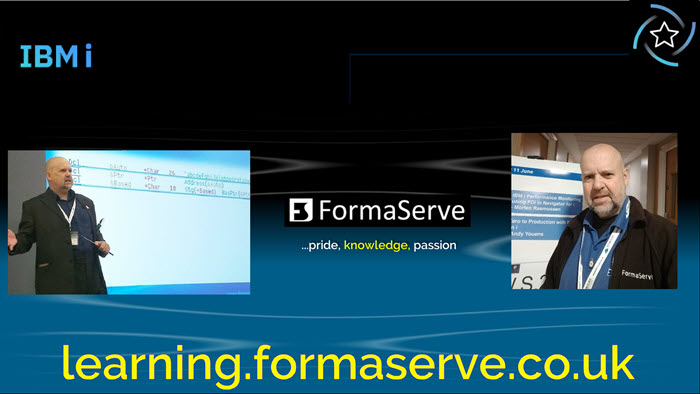

# Andy Youens

&nbsp;

<h2>Hello there, I'm Andy Youens  </h2>

&nbsp;

I've worked for [FormaServe Systems Ltd](https://www/formaserve.co.uk) in the UK for over 30 years.  With over 40 years IBM midrange experience.

A lover of everything IBM i, especially Open-source on the IBM i.

I've produced many videos on the IBM i, check them out [here.](https://learning.formaserve.co.uk)

I'm an IBM Champion & also a member of IBMs ISV Advisory Council.

I talk at IBM i user groups around the world & write for the PowerWire publication.
Check out my [PowerWire articles here.](https://powerwire.eu/author/andy-youens)

I'm proud to have served in His Majesty's Royal Navy for 10 years, the Senior Service!

Born in London, made in the Royal Navy!

Don't forget to leave a ⭐ if you find my repo's useful.

Thank-you!🎆

&nbsp;

## 🚩 Connect with me!
Ask me about anything IBM i or Open Source on IBM i

- LinkedIn: https://linkedin.com/in/andyyouens
- Twitter: https://twitter.com/AndyYouens
- Twitter: https://twitter.com/FormaServe
- Website: https://learning.formaserve.co.uk
- Website: https://www.formaserve.co.uk

&nbsp;

  <h2 align="left">☕ Support</h2>
  
&nbsp;

  

    
  

  
&nbsp;

&nbsp;

## 🏠 Location
I'm located in London England.

&nbsp;

## Open Source on IBM i - Oh Yea!

👍👍

&nbsp;

## ✔️ Github Stuff

